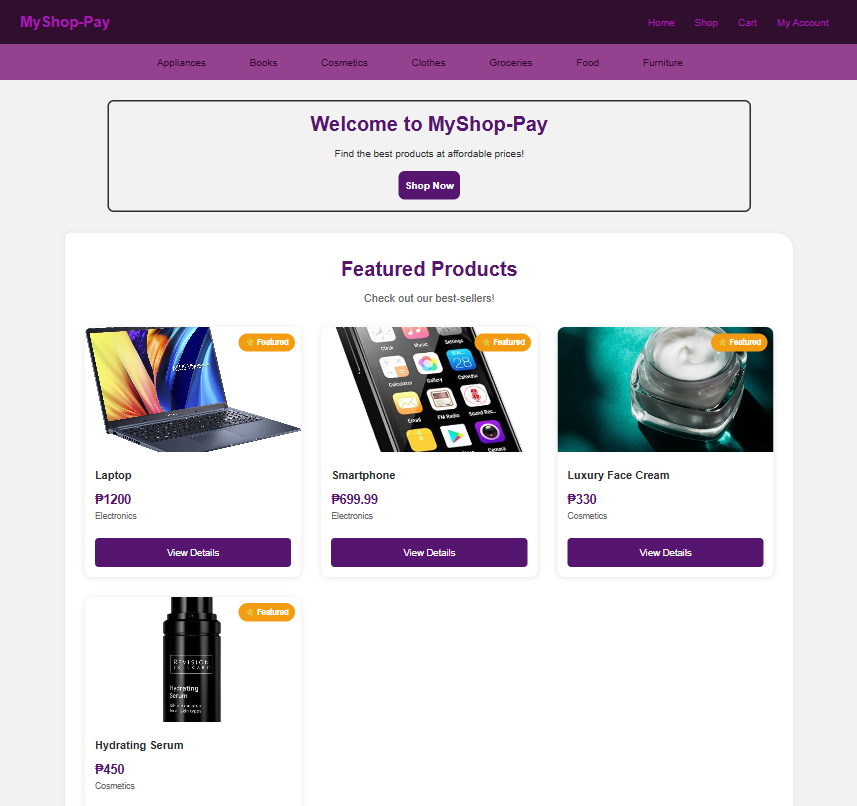
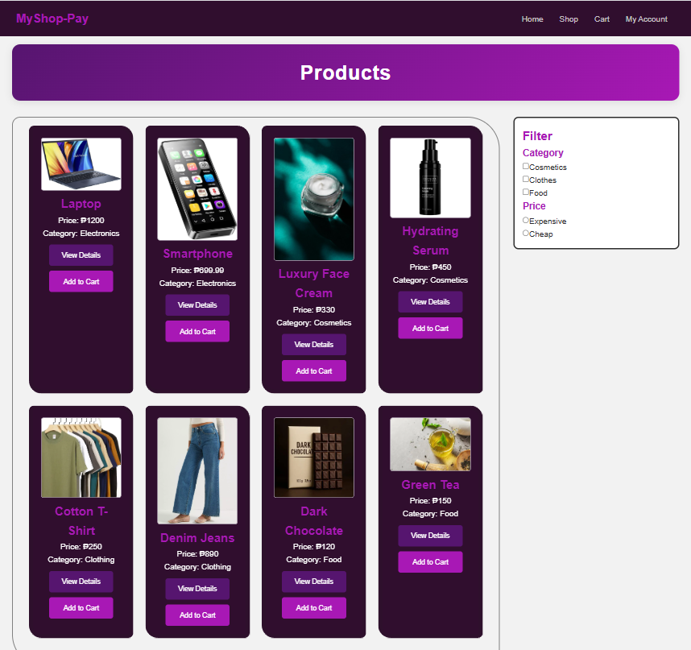
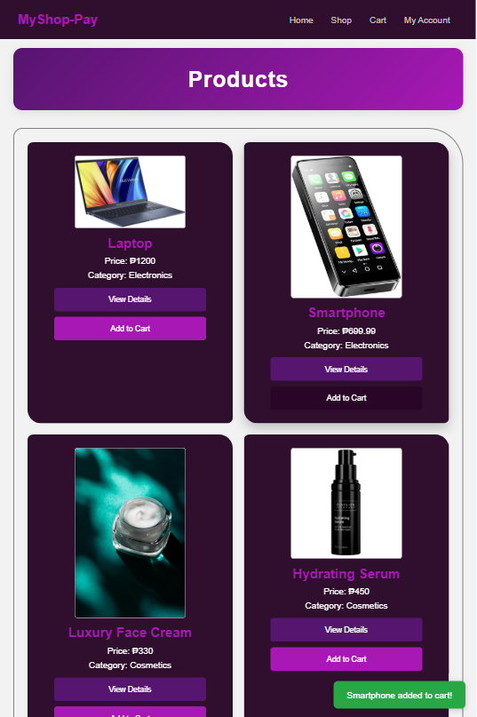
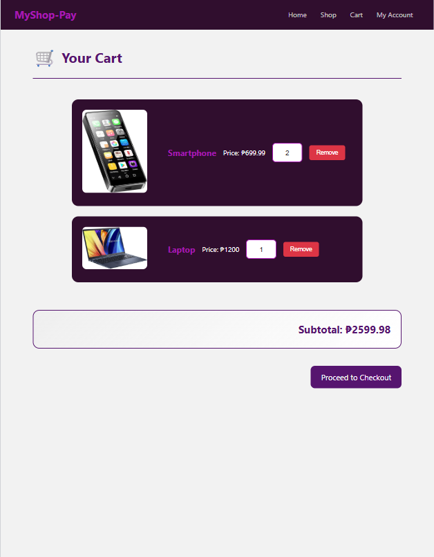
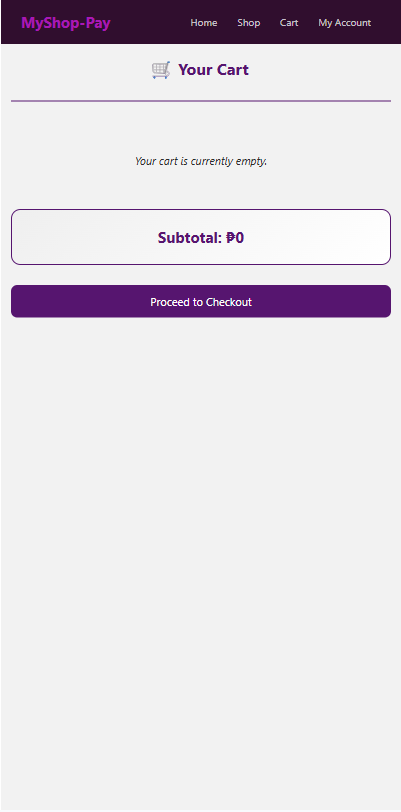
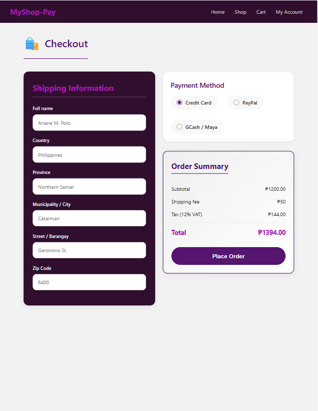
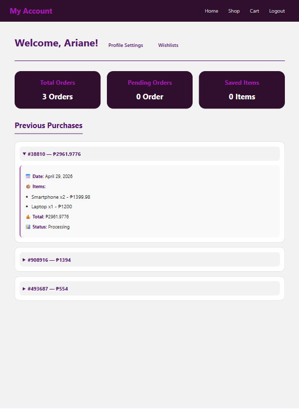
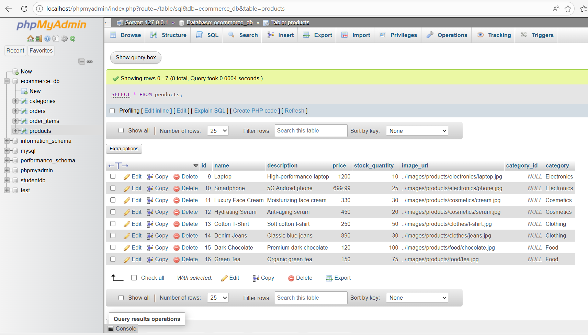

# E-commerce API - Product Catalog

## Overview
RESTful API for managing products using Spring Boot with **MySQL database persistence** (JPA/Hibernate). This is Laboratory 8 - Database Integration and Consuming RESTful Web Services with Fetch API.

## Technology Stack
- Spring Boot 4.0.5
- Java 25
- Spring Data JPA / Hibernate
- MySQL / MariaDB
- Lombok
- Gradle

---

## Screenshots

### Home Page (Landing Page)


### Products Page


### Add to Cart Feature


### Cart Page


### Remove Item from Cart


### Checkout Page


### Order Purchased


### Browser Console - Successful Fetch


---

## Database Schema

### Tables and Relationships

| Table | Columns | Primary Key | Foreign Key |
|-------|---------|-------------|-------------|
| **categories** | id, name, description | id | - |
| **products** | id, name, description, price, stock_quantity, category, image_url | id | category → categories.name |
| **orders** | id, customer_name, order_number, order_date, total_amount, status | id | - |
| **order_items** | id, quantity, unit_price, order_id, product_id | id | order_id → orders.id, product_id → products.id |

### Entity Relationship Diagram
┌─────────────────┐         ┌─────────────────┐
│    Category     │         │     Product     │
├─────────────────┤         ├─────────────────┤
│ id (PK)         │◄────────│ id (PK)         │
│ name            │   1:N    │ name            │
│ description     │         │ description     │
└─────────────────┘         │ price           │
                            │ stock_quantity  │
                            │ category (FK)   │
                            │ image_url       │
                            └─────────────────┘
                                  ▲
                                  │
                                  │ N:1
                                  │
┌─────────────────┐         ┌─────────────────┐
│     Order       │         │   OrderItem     │
├─────────────────┤         ├─────────────────┤
│ id (PK)         │────────►│ id (PK)         │
│ customer_name   │   1:N    │ quantity        │
│ order_number    │         │ unit_price      │
│ order_date      │         │ order_id (FK)   │
│ total_amount    │         │ product_id (FK) │
│ status          │         └─────────────────┘
└─────────────────┘

text

### Database Screenshot (phpMyAdmin)


---

## API Endpoints (Database-Backed)

All endpoints are prefixed with `/api/v1`

| Method | Endpoint | Description | Request Body | Response Status |
|--------|----------|-------------|--------------|-----------------|
| GET | `/products` | Get all products from database | - | 200 OK |
| GET | `/products/{id}` | Get product by ID | - | 200 OK / 404 Not Found |
| GET | `/products/filter?filterType={type}&filterValue={value}` | Filter by category/price/name | - | 200 OK / 400 Bad Request |
| POST | `/products?categoryId={id}` | Create new product | Product JSON | 201 Created / 400 Bad Request |
| PUT | `/products/{id}?categoryId={id}` | Full update | Product JSON | 200 OK / 404 Not Found |
| PATCH | `/products/{id}` | Partial update | Partial JSON | 200 OK / 404 Not Found |
| DELETE | `/products/{id}` | Delete product | - | 204 No Content / 404 Not Found |

### Sample API Request (POST)

```http
POST http://localhost:8080/api/v1/products?categoryId=1
Content-Type: application/json

{
    "name": "Wireless Mouse",
    "description": "Ergonomic wireless mouse",
    "price": 29.99,
    "stockQuantity": 50,
    "imageUrl": "../images/products/mouse.jpg"
}
Sample API Response (GET /products)
json
[
    {
        "id": 1,
        "name": "Laptop",
        "description": "High-performance laptop",
        "price": 1200.0,
        "category": "Electronics",
        "stockQuantity": 10,
        "imageUrl": "../images/products/electronics/laptop.jpg"
    },
    {
        "id": 2,
        "name": "Smartphone",
        "description": "5G Android phone",
        "price": 699.99,
        "category": "Electronics",
        "stockQuantity": 25,
        "imageUrl": "../images/products/electronics/phone.jpg"
    }
]
Browser Console - Successful Fetch Response


Status Codes
Code	Meaning	When Used
200	OK	Successful GET, PUT, PATCH requests
201	Created	Successful POST (product creation)
204	No Content	Successful DELETE
400	Bad Request	Invalid input data (missing name, negative price, etc.)
404	Not Found	Product ID does not exist in database
500	Internal Server Error	Server or database connection error
Setup Instructions
Prerequisites
Java 25+

MySQL (XAMPP recommended)

Gradle

Installation Steps
Clone the repository

bash
git clone https://github.com/poloariane/EcommerceApi.git
cd EcommerceApi
Start MySQL (using XAMPP Control Panel)

Open XAMPP Control Panel

Click "Start" for MySQL

Create database in phpMyAdmin

Open browser: http://localhost/phpmyadmin

Click "New" on the left sidebar

Database name: ecommerce_db

Click "Create"

Configure application.properties (located in src/main/resources/)

properties
spring.application.name=EcommerceApi

# Database Configuration
spring.datasource.url=jdbc:mysql://localhost:3306/ecommerce_db?useSSL=false&serverTimezone=UTC&allowPublicKeyRetrieval=true
spring.datasource.username=root
spring.datasource.password=

# JPA / Hibernate Configuration
spring.jpa.hibernate.ddl-auto=update
spring.jpa.show-sql=true
spring.jpa.properties.hibernate.format_sql=true
spring.jpa.database-platform=org.hibernate.dialect.MySQLDialect
Run the application

bash
./gradlew bootRun
Test the API - Open browser and navigate to:

text
http://localhost:8080/api/v1/products
Frontend Integration
The frontend uses Fetch API to consume this backend. Here's the main fetch function with error handling:

javascript
/**
 * Fetches all products from the Spring Boot backend API
 * Uses async/await pattern with proper error handling
 * 
 * @returns {Promise<Array>} List of products from the database
 */
async function fetchProducts() {
    try {
        console.log('🔄 Fetching products from API:', `${API_BASE_URL}/products`);
        
        const response = await fetch(`${API_BASE_URL}/products`);
        
        // Check if response is OK (status 200-299)
        if (!response.ok) {
            // Throw custom error based on status code
            if (response.status === 404) {
                throw new Error('❌ API endpoint not found (404). Backend not running?');
            } else if (response.status === 500) {
                throw new Error('❌ Server error (500). Check backend logs.');
            } else {
                throw new Error(`❌ HTTP error! Status: ${response.status}`);
            }
        }
        
        const data = await response.json();
        console.log('✅ Products fetched successfully:', data.length, 'products found');
        return data;
        
    } catch (error) {
        console.error('❌ Error fetching products:', error.message);
        return [];
    }
}
CORS Configuration
To allow frontend to communicate with backend, add this configuration:

java
package com.ws101.abundopolo.ecommerceapi.config;

import org.springframework.context.annotation.Configuration;
import org.springframework.web.servlet.config.annotation.CorsRegistry;
import org.springframework.web.servlet.config.annotation.WebMvcConfigurer;

@Configuration
public class WebConfig implements WebMvcConfigurer {
    
    @Override
    public void addCorsMappings(CorsRegistry registry) {
        registry.addMapping("/api/**")
                .allowedOrigins("http://localhost:5500", "http://127.0.0.1:5500")
                .allowedMethods("GET", "POST", "PUT", "DELETE", "PATCH", "OPTIONS")
                .allowedHeaders("Authorization", "Content-Type")
                .allowCredentials(true);
    }
}
Test Results
Flow Test Results
Test	Expected Result	Actual Result	Status
Products load from database	Products visible on page	8 products displayed	✅ PASS
Add to Cart	Item added to cart, toast notification appears	Smartphone added notification shown	✅ PASS
Cart displays items	Items show with correct quantity	Laptop (1), Smartphone (2)	✅ PASS
Remove from Cart	Item removed, cart becomes empty	Cart empty message shown	✅ PASS
Checkout form	Form validates required fields	Fields validated successfully	✅ PASS
Place Order	Order saved, redirect to account	Order #38810 created	✅ PASS
Responsive Check Results
Device	Width	Layout	Status
Desktop	>1024px	3-4 columns	✅ PASS
Tablet	768-1024px	2 columns	✅ PASS
Mobile	<768px	1 column	✅ PASS
JPA Entity Documentation
Product.java
java
/**
 * Product Entity - Represents products in the e-commerce system.
 * Mapped to the "products" table in the database.
 * 
 * @author Abundo Polo
 * @version 2.0
 */
@Entity
@Table(name = "products")
public class Product {
    // fields and methods
}
Category.java
java
/**
 * Category Entity - Represents product categories.
 * One-to-Many relationship with Product entity.
 * 
 * @author Abundo Polo
 * @version 1.0
 */
@Entity
@Table(name = "categories")
public class Category {
    // fields and methods
}
Authors
Abundo, Clarissa Mae T.

Polo, Ariane C.

GitHub Repository
https://github.com/poloariane/EcommerceApi